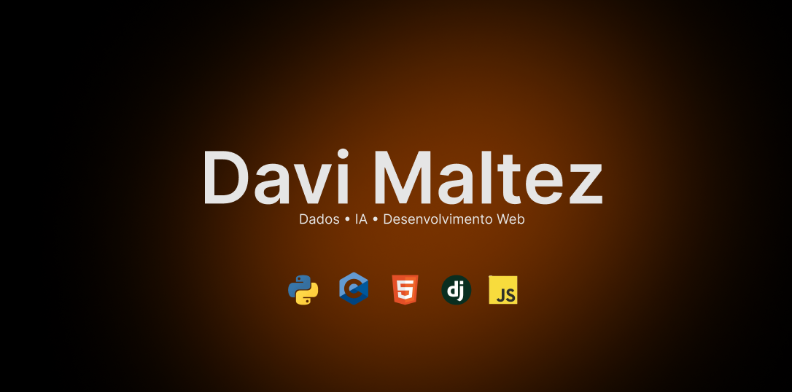

  

<h2 align="center">Oii, prazer! Me chamo Davi Maltez 👋</h2>

  Sou estudante de <strong>Ciência da Computação</strong> na <strong>CESAR School</strong>, apaixonado por tecnologia e por descobrir novas possibilidades dentro desse universo tão amplo, que facilita a vida de tanta gente.

  Atualmente, tenho muito interesse pelas áreas de <strong>Dados</strong> e <strong>Inteligência Artificial</strong>, mas também estou aberto a experimentar, aprender e explorar o que vier pela frente 😉

---

### 🚀 Stacks que estou usando

  

---

### 🌎 Idiomas

- Português: nativo  
- Inglês: técnico  

---

### 📫 Contato

  
  

---

  ✨ Em constante aprendizado, construindo projetos e explorando o mundo da tecnologia.

